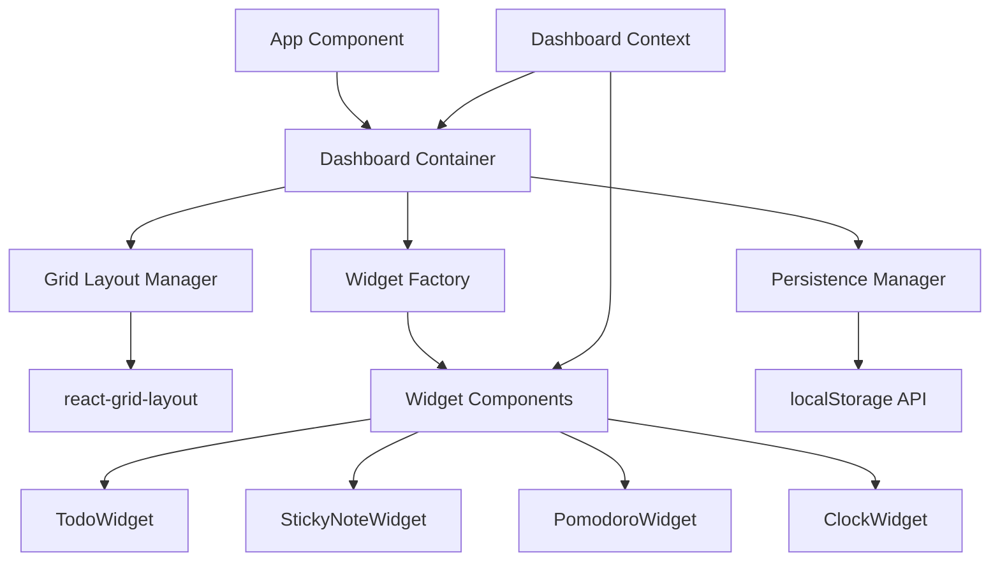

# Design Document

## Overview

Bloxely is a React-based web application that provides a modular, grid-based dashboard for productivity tools. The application uses a component-driven architecture with a centralized state management system to handle widget positioning, content, and persistence. The design emphasizes simplicity, performance, and user control over their workspace layout.

## Architecture

### Technology Stack
- **Frontend Framework:** React 18 with TypeScript for type safety and modern development
- **Build Tool:** Vite for fast development and optimized production builds
- **Styling:** Tailwind CSS for utility-first styling and rapid UI development
- **Grid System:** react-grid-layout library for drag-and-drop grid functionality
- **State Management:** React Context API with useReducer for centralized state
- **Persistence:** Browser localStorage for client-side data persistence
- **Deployment:** Vercel for seamless deployment and hosting

### System Architecture



## Components and Interfaces

### Core Components

#### 1. App Component
- **Purpose:** Root component that provides global context and routing
- **Responsibilities:** Initialize dashboard context, handle theme provider
- **Props:** None
- **State:** Global application state through DashboardContext

#### 2. Dashboard Container
- **Purpose:** Main container that orchestrates the dashboard functionality
- **Responsibilities:** Manage widget lifecycle, handle layout changes, coordinate persistence
- **Props:** None
- **State:** Manages dashboard layout and widget configurations

#### 3. Grid Layout Manager
- **Purpose:** Wrapper around react-grid-layout for grid functionality
- **Responsibilities:** Handle drag/drop, resize operations, maintain grid constraints
- **Props:** `layout`, `onLayoutChange`, `children`
- **Key Features:** 
  - 12-column responsive grid
  - Minimum widget size constraints
  - Collision detection and prevention

#### 4. Widget Factory
- **Purpose:** Dynamic widget creation and management
- **Responsibilities:** Instantiate widgets based on type, provide widget registry
- **Interface:**
```typescript
interface WidgetFactory {
  createWidget(type: WidgetType, id: string, config?: WidgetConfig): ReactElement;
  getAvailableWidgets(): WidgetDefinition[];
  registerWidget(definition: WidgetDefinition): void;
}
```

#### 5. Base Widget Interface
All widgets implement a common interface for consistency:
```typescript
interface BaseWidget {
  id: string;
  type: WidgetType;
  title: string;
  config: WidgetConfig;
  onUpdate: (data: any) => void;
  onRemove: () => void;
}
```

### Widget Components

#### TodoWidget
- **Data Structure:** Array of tasks with id, text, completed status
- **Key Features:** Add/remove tasks, toggle completion, persistent state
- **Size Constraints:** Minimum 2x3 grid units

#### StickyNoteWidget  
- **Data Structure:** Text content and color selection
- **Key Features:** Real-time text editing, color picker, auto-save
- **Size Constraints:** Minimum 2x2 grid units

#### PomodoroWidget
- **Data Structure:** Timer state, current mode (work/break), settings
- **Key Features:** Start/pause/reset controls, audio notifications, mode switching
- **Size Constraints:** Fixed 3x2 grid units

#### ClockWidget
- **Data Structure:** Time format preference (12/24 hour)
- **Key Features:** Real-time updates, format toggle, date display
- **Size Constraints:** Fixed 2x1 grid units

## Data Models

### Dashboard State
```typescript
interface DashboardState {
  layout: GridLayout[];
  widgets: Record<string, WidgetData>;
  settings: DashboardSettings;
}

interface GridLayout {
  i: string; // widget id
  x: number;
  y: number;
  w: number;
  h: number;
  minW?: number;
  minH?: number;
  maxW?: number;
  maxH?: number;
}

interface WidgetData {
  id: string;
  type: WidgetType;
  content: any;
  config: WidgetConfig;
  createdAt: Date;
  updatedAt: Date;
}
```

### Widget-Specific Models
```typescript
interface TodoData {
  tasks: Task[];
}

interface Task {
  id: string;
  text: string;
  completed: boolean;
  createdAt: Date;
}

interface StickyNoteData {
  content: string;
  color: string;
}

interface PomodoroData {
  timeRemaining: number;
  isRunning: boolean;
  mode: 'work' | 'break';
  workDuration: number;
  breakDuration: number;
}

interface ClockData {
  format: '12h' | '24h';
  showDate: boolean;
}
```

## Error Handling

### Client-Side Error Boundaries
- **Widget Error Boundary:** Isolates widget failures to prevent dashboard crashes
- **Global Error Boundary:** Catches unhandled errors and provides user feedback
- **Persistence Error Handling:** Graceful degradation when localStorage is unavailable

### Error Recovery Strategies
1. **Widget Isolation:** Failed widgets display error state without affecting others
2. **Data Recovery:** Attempt to restore from backup or provide reset option
3. **User Feedback:** Clear error messages with actionable recovery steps

### Validation
- **Layout Validation:** Ensure grid positions are valid before applying
- **Widget Data Validation:** Validate widget content before persistence
- **Type Safety:** TypeScript interfaces prevent runtime type errors

## Testing Strategy

### Unit Testing
- **Widget Components:** Test individual widget functionality and state management
- **Utility Functions:** Test persistence, validation, and helper functions
- **Custom Hooks:** Test dashboard state management and widget lifecycle

### Integration Testing
- **Grid Layout:** Test drag/drop functionality and layout persistence
- **Widget Interactions:** Test widget creation, updates, and removal
- **Persistence Flow:** Test save/load functionality across browser sessions

### End-to-End Testing
- **User Workflows:** Test complete user journeys from widget creation to persistence
- **Cross-Browser Compatibility:** Ensure functionality across modern browsers
- **Performance Testing:** Validate smooth interactions with multiple widgets

### Testing Tools
- **Jest:** Unit and integration testing framework
- **React Testing Library:** Component testing utilities
- **Cypress:** End-to-end testing for user workflows

## Performance Considerations

### Optimization Strategies
1. **Lazy Loading:** Load widget components only when needed
2. **Memoization:** Use React.memo for widget components to prevent unnecessary re-renders
3. **Debounced Persistence:** Batch localStorage updates to reduce I/O operations
4. **Virtual Scrolling:** For large numbers of widgets (future enhancement)

### Bundle Optimization
- **Code Splitting:** Separate widget bundles for dynamic loading
- **Tree Shaking:** Remove unused code from final bundle
- **Asset Optimization:** Compress images and optimize fonts

### Runtime Performance
- **Efficient Re-renders:** Minimize component updates through proper state management
- **Memory Management:** Clean up timers and event listeners in widget cleanup
- **Grid Performance:** Optimize react-grid-layout configuration for smooth interactions